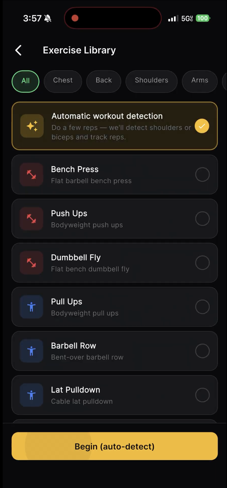
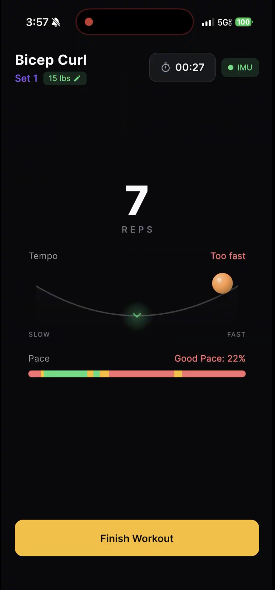
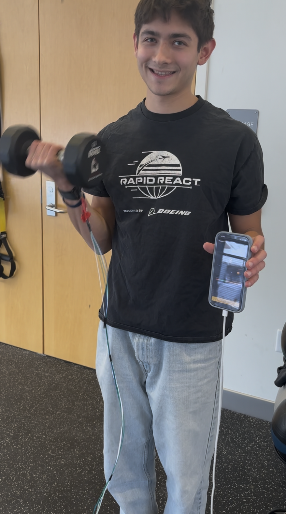
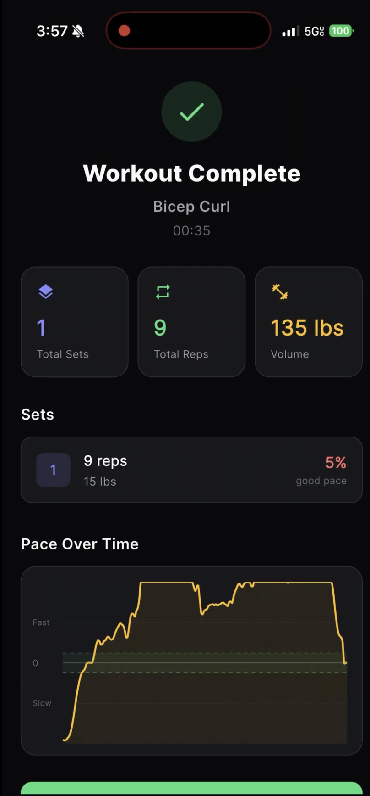

<table>
<tr>
<td>

# Auto Gains

Smart rep counting and exercise detection using an accelerometer and a Flutter app built during TartanHacks 2026.

Auto Gains is a mobile app that connects to a wearable IMU (accelerometer) via a Python backend. It **automatically detects** which exercise you're doing (e.g. bicep curl vs shoulder press), **counts reps in real time** with a streaming pipeline, and records workout history.

**Demo Video:** https://drive.google.com/file/d/1cs5D7jxhox0Pw5hGF3zjvJ99UNmRP5hl/view?usp=drivesdk

</td>
<td align="right">

</td>
</tr>
</table>

---

## Features

- **Exercise detection** — Classifier (PCA + Random Forest) identifies exercise type from a short window of IMU data (e.g. bicep curl vs shoulder press).
- **Real-time rep counting** — Streaming pipeline with online PCA, causal smoothing, and a peak–valley state machine; no batch processing or lookahead.
- **Workout history** — View recent sessions and basic stats from the home screen.
- **Flexible connectivity** — Backend can run locally (same network as phone) or be exposed with **ngrok** for remote access (e.g. phone on cellular).

---

## Usage (in the app)

1. **Home** — View recent workouts and tap **Start Workout**.
   <br>

2. **Workout detection** — App connects to the backend (WebSocket). When connected, start moving; the backend runs the classifier on a short window and sends back the detected exercise (and initial rep count). You're then taken to the active workout screen.
   <br>

3. **Active workout** — Reps update in real time from the backend's streaming rep counter.
   <br>

4. **Summary** — After finishing, you see a short summary and can return home; the session is stored locally.
   <br>

---

## Tech Stack

| Layer        | Tech |
|-------------|------|
| **App**     | Flutter (Dart), `web_socket_channel`, `sensors_plus`, `fl_chart` |
| **Backend** | Python 3, WebSockets, PySerial |
| **Hardware**| Arduino with 3-axis accelerometer |
| **ML**      | scikit-learn (PCA, Random Forest), joblib; sliding-window features from IMU data |
| **Rep logic** | Custom streaming pipeline: online PCA, exponential smoothing, peak–valley detection |

---

## Getting Started

### Prerequisites

- **Flutter** SDK (e.g. 3.10+)
- **Python 3** with venv recommended
- **Arduino** with IMU sending lines of `x y z` (space-separated integers) over serial at 115200 baud
- **(Optional)** [ngrok](https://ngrok.com/download) v3+ for exposing the backend to the internet

### 1. Backend (Python)

From the repo root (or from `auto_gains/`):

```bash
cd backend
python -m venv venv
source venv/bin/activate   # Windows: venv\Scripts\activate
pip install -r requirements.txt
```

Run the WebSocket server:

- **With Arduino connected** (default port `/dev/cu.usbmodem1301` on Mac):

  ```bash
  python ws_server.py
  ```

- **Without hardware** (replay from `imu_data.txt`):

  ```bash
  python ws_server.py --mock
  ```

- **Custom serial port:**

  ```bash
  python ws_server.py --port /dev/cu.usbmodem1401
  ```

Server listens on **port 8765** by default.

### 2. Point the app at the backend

Edit `lib/config/backend_config.dart`:

- **Same machine / same Wi‑Fi:** use your computer's IP and port, e.g.  
  `ws://192.168.1.100:8765`  
  (Find IP on Mac: `ifconfig | grep "inet "`.)
- **Chrome/desktop on same machine:** `ws://127.0.0.1:8765`
- **Phone elsewhere (e.g. cellular):** run ngrok and use the ngrok WebSocket URL (see below).

### 3. Run the Flutter app

```bash
flutter pub get
flutter run
```

Pick your device (iOS simulator, Android, or Chrome).

### 4. (Optional) Expose backend with ngrok

If the phone is not on the same network as the backend:

1. Install and configure [ngrok](https://ngrok.com/download) (v3+). Add your authtoken:  
   `ngrok authtoken <your-token>`
2. Start the backend, then in another terminal:

   ```bash
   ngrok http 8765
   ```

3. Copy the **HTTPS** URL ngrok shows (e.g. `https://xxxx.ngrok-free.app`), replace `https` with `ws` and add the path if any, e.g.  
   `wss://xxxx.ngrok-free.app`  
   and set `kBackendWsUrl` in `lib/config/backend_config.dart` to that WebSocket URL.
4. Restart the app and connect; the app will talk to your backend through ngrok.

---

## Training the classifier (optional)

The included `classifier_model.joblib` is trained on bicep vs shoulder press. To collect new data and retrain:

1. **Record labeled data** — In `backend/collect_data.py`, set `label = "bicep"` or `"shoulders"`. Run it while performing that exercise; stop with Ctrl+C. Files are saved under `training_data/<label>/`.
2. **Train** — From `backend/`:

   ```bash
   python train_classifier.py
   ```

   This overwrites `classifier_model.joblib`. Restart `ws_server.py` to load the new model.

---

## Contributors

- Ethan Seiz
- Dhruv Jain
- Vishal Ramesh